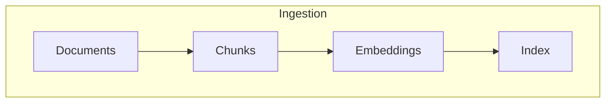
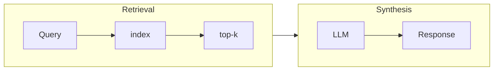

# contextual-retrieval
Exploring various way to add context to the embedding to improve retrieval 

## Methods for Incorporating Context
1. [Adding generic document summaries to chunks](https://aclanthology.org/W02-0405.pdf)
2. [Hypothetical document embedding](https://arxiv.org/abs/2212.10496)
3. [Summary-based indexing](https://www.llamaindex.ai/blog/a-new-document-summary-index-for-llm-powered-qa-systems-9a32ece2f9ec)
4. Contextual BM25

## Dependencies
- [Chroma](https://github.com/chroma-core/chroma)
- Google GenerativeAI: Using Gemnini as the model for embeddings
- llamaindex

## High Level Workflows

