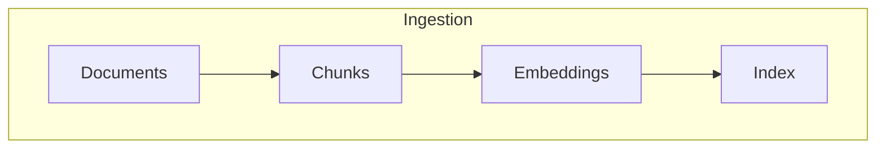
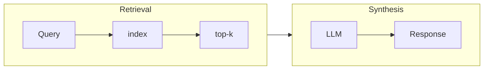

# RAG Techniques
Exploring various way to implement RAG

## Techniques
1. [Naive RAG (Simple RAG)](./simple_rag.py)
   - Basic retrieval and generation without advanced processing

2. Simple RAG with Memory
   - Maintains context from previous interactions

3. Branched RAG
   - Performs multiple retrieval steps, refining the search based on intermediate results

4. HyDE (Hypothetical Document Embedding)
   - Generates a hypothetical ideal document before retrieval to improve search relevance

5. Adaptive RAG
   - Dynamically adjusts retrieval and generation strategies based on query type or difficulty

6. Corrective RAG (CRAG)
   - Iteratively refines generated responses by fact-checking against retrieved information

7. Self-RAG
   - Includes self-reflection and self-grading on both retrieved documents and generated responses

8. Agentic RAG
   - Combines RAG with agentic behavior for complex, multi-step problem-solving

9. Modular RAG
   - Separates retrieval and generation components into distinct, modular parts

10. Hierarchical Index Retrieval
    - Organizes data into a hierarchical structure for more precise retrieval

11. Hybrid Search
    - Integrates various search techniques, including keyword-based, semantic, and vector searches

12. Recursive Retrieval and Query Engine
    - Acquires smaller chunks initially, then larger chunks with more contextual information

13. StepBack Approach
    - Encourages reasoning around broader concepts and principles

14. Sub-Queries
    - Employs various query strategies like tree queries, vector queries, or sequential querying of chunks

15. Retriever Ensembling and Reranking
    - Combines multiple retrieval models and refines results based on additional criteria

## Dependencies
- [Chroma](https://github.com/chroma-core/chroma)
- Google GenerativeAI: Using Gemnini as the model for embeddings
- llamaindex

## High Level Workflows

