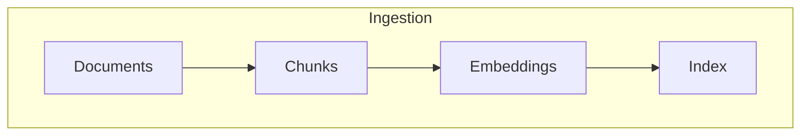
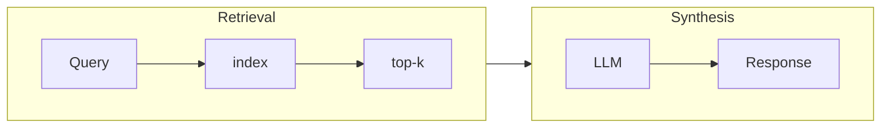

# RAG Techniques
Exploring various way to implement RAG

## Techniques
1. [Naive RAG (Simple RAG)](./simple_rag.py)
   - Basic retrieval and generation without advanced processing

   Sample Output
   ```
   Query: Earnings before taxes
   Response: Apple Inc. reported income before provision for income taxes of $25,494 million for the
   three months ended June 29, 2024, and $93,875 million for the nine months ended June 29, 2024.
   ```

2. [Simple RAG with Memory](./rag_with_mem.py)
   - Maintains context from previous interactions

   Sample Output
   ```
   Query 1: Total marketable securities on June 29, 2024? 
   Response 1: Based on the condensed consolidated balance sheet as of June 29, 2024, the total marketable
   securities held by Apple Inc. was $127,476 million, which includes $36,236 million in current marketable
   securities and $91,240 million in non-current marketable securities.

   Query 2: How about on September 2023? 
   Response 2: According to the condensed consolidated balance sheet, as of September 30, 2023, Apple Inc.
   held total marketable securities of $132,134 million, consisting of $31,590 million in current marketable
   securities and $100,544 million in non-current marketable securities. 

   Query 3: What's the percentage change between them? 
   Response 2: To calculate the percentage change in total marketable securities between June 29, 2024 and
   September 30, 2023,
   I will use the following formula:

   Percentage change = (New Value - Original Value) / Original Value x 100

   Total marketable securities on June 29, 2024: $127,476 million
   Total marketable securities on September 30, 2023: $132,134 million

   Percentage change = ($127,476 million - $132,134 million) / $132,134 million x 100
            = (-$4,658 million) / $132,134 million x 100
            = -3.53%

   Therefore, the total marketable securities held by Apple Inc. decreased by 3.53% from September 30, 2023 to
   June 29, 2024.

   ```

3. [Branched RAG](./branched_rag.py)
   - Performs multiple retrieval steps, refining the search based on intermediate results
   
   Sample Output
   ```
   Query: Total earnings of Apple during Q3 2024 and the average stock price during that period, 
   Response: Based on the provided information, Apple Inc.'s total earnings (net income) during Q3 2024 were
   $19.8 billion. The average stock price of Apple during Q3 2024, calculated from the monthly prices in July,
   August, and September, was $232.67.
   ```

4. Contextual RAG
   - Prepends chunk-specific explanatory context to each chunk before embedding (“Contextual Embeddings”)

4. HyDE (Hypothetical Document Embedding)
   - Generates a hypothetical ideal document before retrieval to improve search relevance

5. Adaptive RAG
   - Dynamically adjusts retrieval and generation strategies based on query type or difficulty

6. Corrective RAG (CRAG)
   - Iteratively refines generated responses by fact-checking against retrieved information

7. Self-RAG
   - Includes self-reflection and self-grading on both retrieved documents and generated responses

8. Agentic RAG
   - Combines RAG with agentic behavior for complex, multi-step problem-solving

9. Modular RAG
   - Separates retrieval and generation components into distinct, modular parts

10. Hierarchical Index Retrieval
    - Organizes data into a hierarchical structure for more precise retrieval

11. Hybrid Search
    - Integrates various search techniques, including keyword-based, semantic, and vector searches

12. Recursive Retrieval and Query Engine
    - Acquires smaller chunks initially, then larger chunks with more contextual information

13. StepBack Approach
    - Encourages reasoning around broader concepts and principles

14. Sub-Queries
    - Employs various query strategies like tree queries, vector queries, or sequential querying of chunks

15. Retriever Ensembling and Reranking
    - Combines multiple retrieval models and refines results based on additional criteria

## Dependencies
- [Chroma](https://github.com/chroma-core/chroma)
- Google GenerativeAI: Using Gemnini as the model for embeddings
- llamaindex

## High Level Workflows




